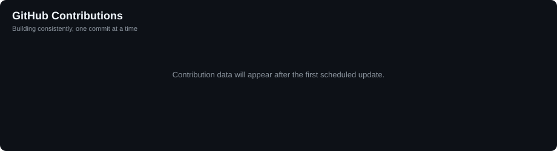

# Aayush Saxena

### AI Validation & Testing | GenAI & LLM Systems | AI Evaluation | Agentic AI

Building, breaking, evaluating, and improving AI systems — from LLM applications and RAG pipelines to agentic workflows and production AI.

---

    
    
    
    

---

## About Me

I work at the intersection of **AI engineering and AI quality**, with a focus on understanding not only how AI systems are built, but also how we can **measure, evaluate, validate, and improve them**.

I'm a tech enthusiast who enjoys going down the rabbit hole — learning how a system works, building a version of it, testing where it breaks, and then figuring out how to make it better.

My current work and interests span:

- **Generative AI & LLM applications**
- **LLM evaluation and AI validation**
- **RAG and retrieval systems**
- **LLM-as-a-Judge**
- **Agentic AI and tool-using systems**
- **Multimodal AI**
- **MLOps and production AI systems**
- **AI observability, reliability, and guardrails**

I enjoy turning ideas into working systems and then asking the harder engineering questions:

> Does it work reliably?
> How do we measure it?
> How do we detect regressions?
> What happens when the system fails?
> How do we make it production-ready?

My GitHub is where I document that journey through **projects, experiments, research, and practical implementations**.

---

## What I'm Building

Three active threads across my current AI engineering work:

### AI Evaluation & Validation

An **AI Evaluation Platform** focused on systematic evaluation of LLM, RAG, and agentic AI systems.

`Metrics` · `Evaluation Datasets` · `LLM-as-a-Judge` · `Rubrics` · `Regression Testing` · `RAG & Agent Evaluation`

### JARVIS OS

A personal **AI Operating System** being built incrementally as a real software project — moving from conversation and memory toward tools, research, automation, and agent workflows.

`Conversation` · `Tool Calling` · `Memory` · `Web Research` · `RAG` · `Voice` · `Agents` · `Observability`

### LLM Use-Case Lab

A hands-on laboratory for exploring what modern LLMs can actually do through focused implementations and experiments.

**Build → Experiment → Compare → Measure → Document → Productionize**

`Chatbots` · `Structured Output` · `Tool Calling` · `Vision` · `Documents` · `Audio` · `Agents` · `Evaluation`

---

## Tech Stack

### AI / ML

### LLM & AI Systems

### Cloud, DevOps & Tooling

**Core:** `Python` · `SQL` · `PyTorch` · `TensorFlow` · `scikit-learn` · `XGBoost`

**GenAI:** `LLMs` · `RAG` · `Prompt Engineering` · `LLM-as-a-Judge` · `Agentic AI` · `Multimodal AI`

**Evaluation:** `AI Validation` · `LLM Evaluation` · `Regression Testing` · `Evaluation Datasets` · `Guardrails` · `Human-in-the-Loop`

**Retrieval:** `FAISS` · `Milvus` · `Pinecone` · `Weaviate` · `Embeddings` · `Hybrid Search`

**Engineering:** `FastAPI` · `Docker` · `GitHub Actions` · `CI/CD` · `MLOps` · `Model Monitoring` · `Experiment Tracking`

**Cloud:** `AWS` · `GCP` · `Vertex AI`

---

## Current Focus — Build, Break, Understand

I'm currently exploring the next layer of AI systems:

**LLM Evaluation → RAG Evaluation → Agent Evaluation → AI Observability → Reliable Agentic Systems**

Along the way, I'm especially interested in:

- Understanding how modern LLMs behave beyond benchmark scores
- Designing evaluation systems that catch real-world failures
- Building RAG pipelines and understanding retrieval quality
- Experimenting with agents, tool use, memory, and multi-step reasoning
- Exploring multimodal models and new model capabilities
- Tracing, observing, and debugging AI systems in production
- Turning research ideas into small working prototypes
- Exploring open-source AI frameworks, developer tools, and emerging models

My approach is deliberately hands-on: **if something looks interesting, I build it, break it, measure it, and document what I learn.**

---

## Engineering Philosophy

I don't want to just collect frameworks or follow every new AI trend. I want to understand **what is happening underneath the abstraction**.

> **Learn the concept → Build a working version → Break it → Measure the failure → Improve the system → Share what I learned**

That means my interests naturally move between **research papers, model releases, system architecture, evaluation methodologies, open-source projects, developer tooling, and practical experiments**.

The goal is simple: **stay curious, keep building, and develop a deeper understanding of the technology rather than just using it.**

---

## GitHub Contributions

---

### Always building. Always experimenting. Always learning.

⭐ If you find something useful here, consider starring the repo and following along.

